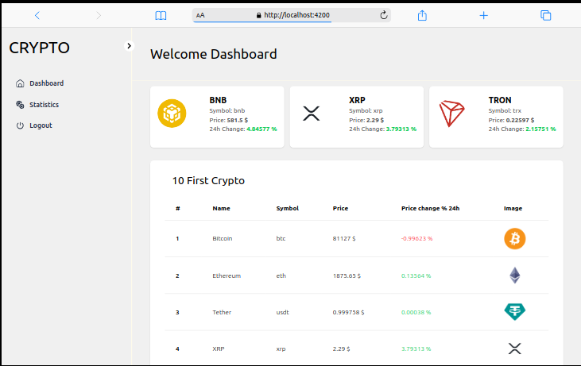
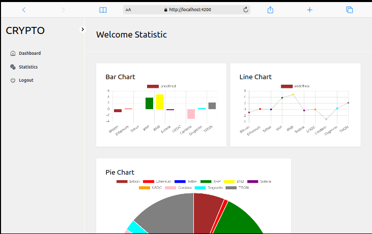
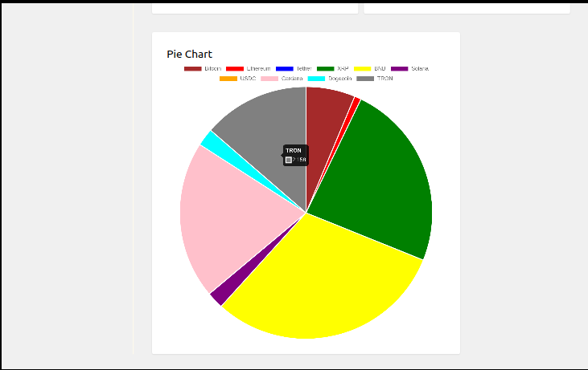

# **Crypto Dashboard**

## **Description**

Ce projet est une application fullstack affichant les **10 premières cryptomonnaies** en termes de capitalisation boursière dans un tableau. Elle met également en évidence les **3 cryptos ayant le plus grand pourcentage de variation sur 24 heures** .

L'application repose sur **Spring Boot (Backend)** et **Angular (Frontend)**, avec une mise en cache côté backend pour optimiser les appels API.

## **Technologies utilisées**

### **Backend (Spring Boot)**
- Java 23
- Spring CLI v3.4.3
- Spring Web
- Spring Cache
- Maven 3.6.3
- API externe : CoinGecko API

### **Frontend (Angular)**
- Angular 19
- TypeScript
- Tailwind 
- ng2-charts (pour le graphique)
- RxJS (gestion des appels HTTP)

---

## **Fonctionnalités**

### **Backend**
✅ Récupération des **données en temps réel** depuis l'API CoinGecko.

✅ Endpoint **/cryptos** : retourne la liste des **10 cryptos** principales (nom, prix, variation, etc.).

✅ Endpoint **/cryptos/top3** : retourne les **3 cryptos** avec la plus forte variation en 24h.

✅ **Mise en cache** des données pour éviter des requêtes répétées à l'API externe.

### **Frontend**
✅ Affichage des **10 cryptos principales** sous forme de **tableau**.

✅ Affichage des **3 cryptos plus performant** sous forme de **tableau**.

✅ Mise en avant des **10 cryptos** sur **3  graphique dynamique , unbachart , un lien chart et un pie chart**.

✅ **Interface responsive** et ergonomique.


## Aprercu Du Dashboard

1. 
2. 
3. 


## **Installation et exécution**

 `bash
   git clone https://github.com/test_springboot_angular
   cd test_springboot_angular``


### **Backend** (Spring Boot)

1. **Changer de ficher** :
   `bash
   cd demo``
   ```

2. **Configurer Maven** et **lancer l'application** :
   ```bash
   mvn clean install
   mvn spring-boot:run
   ```

3. **Accéder aux endpoints** :
   - Liste des cryptos : `http://localhost:8080/cryptos`
   - Top 3 cryptos en variation : `http://localhost:8080/cryptos/top3`

---

### **Frontend** (Angular)

1. **Aller dans le dossier frontend** :
   ```bash
   cd ../dahsboard-crypto
   ```

2. **Installer les dépendances** :
   ```bash
   npm install
   ```

3. **Lancer l'application** :
   ```bash
   ng serve
   ```

4. **Accéder à l'interface** : `http://localhost:4200`

---


## **Contributeurs**

- [Kouawou Alex-Russel](https://github.com/KAlexRussel)

---

## **Licence**

Ce projet est sous licence MIT. Voir le fichier [LICENSE](LICENSE) pour plus d’informations.

